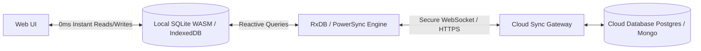

# design reserach

> we need to look at the local-first architecture for this by considering modern methods for db sync between the server and client (in the browser). we made these notes:

In 2026, the web development ecosystem has undergone a massive paradigm shift from "Offline-First" (treating the local database as a temporary caching band-aid) to "Local-First" (treating the client-side database as the primary, authoritative, 0ms-latency source of truth, and replication as an asynchronous background detail).

While the PouchDB/CouchDB stack was a revolutionary pioneer of this concept using CouchDB's revision-tree replication protocol, modern standards have introduced more structured, relational, and mathematically sound solutions for syncing data and resolving conflicts.

1. The Modern Local-First Tech Stack
Instead of Pouch/Couch, modern applications select tools based on their backend infrastructure:

A. For Existing SQL Backends (Postgres/MySQL)
If your cloud database is relational, you no longer have to map documents to SQL rows.

PowerSync & ElectricSQL: These are the current gold standard. They run alongside your cloud Postgres database and automatically replicate scoped, secure subsets of your relational schema to a highly optimized client-side SQLite (WASM) or IndexedDB database. They handle offline queuing, optimistic UI rendering, and sync seamlessly behind the scenes.
B. The Direct Modern NoSQL Successor
RxDB (Reactive Database): If you loved PouchDB’s document-based, reactive architecture, RxDB is its modern successor. It is a premium, highly modular, reactive NoSQL database for JavaScript. It supports multiple storage backends (IndexedDB, OPFS, SQLite) and can synchronize with any backend (CouchDB, GraphQL, or standard REST APIs) using customizable sync protocols.
C. For Collaborative Real-Time SaaS
Zero & Triplit: These are specialized full-stack local-first databases. They compile your schemas, manage partial replication (only syncing what the active user needs rather than the whole database), and sync real-time changes using WebSockets.
2. Modern Conflict Resolution: Managing Clashes
PouchDB relied on Multi-Version Concurrency Control (MVCC) where conflicts resulted in branched revision trees that developers had to fetch, compare, and clean up manually. Today, we use more elegant mathematical systems:

A. CRDTs (Conflict-Free Replicated Data Types)
Rather than checking which revision came first, CRDTs (using libraries like Yjs or Automerge) treat data as a mathematical structure. When two offline users edit the same item, the CRDT merges the changes deterministically.

How it works: Every mutation is tracked as an atomic operation with a stable ID.
Result: Every device eventually converges on the exact same state automatically, without requiring a central server to mediate who won. This is the technology powering modern collaborative tools.
B. HLCs (Hybrid Logical Clocks)
If your app uses a simpler Last-Write-Wins (LWW) strategy, relying on the client's system clock is dangerous because device clocks can be skewed (e.g., if a user's clock is 5 minutes slow, their edits will be silently ignored).

The standard: Modern engines use Hybrid Logical Clocks (HLCs). HLCs combine physical wall-clock time with a logical counter. This ensures that every operation has a strictly increasing, globally unique coordinator, guaranteeing correct execution order.
C. Prevent "Ghost Resurrections" using Tombstones
In an offline-first app, if Device A deletes a task while offline, and Device B edits that same task while online:

If Device A physically deletes the row from its local database, when it reconnects, the sync engine sees Device B's update but does not know the row was deleted on Device A. The task gets resurrected!
The standard: We use Tombstones (marking rows with deleted_at or is_deleted = true instead of performing a hard delete). The sync engine propagates the tombstone to the cloud, and a background worker cleans up deleted rows after a safe sync window.
3. Best-in-Class Implementation Strategy for our Todo App
If we were to upgrade this Todo app to a cloud-synced, conflict-resilient PWA, the modern approach would be:




1. Optimistic UI Updates (0ms Latency)
When a user adds or checks off a todo, the app writes immediately to the local IndexedDB/SQLite database. The UI updates instantly. The user experiences zero spinner states.

2. Native Background Sync API
To ensure that writes are synced even if the user closes the PWA immediately after making a change:

We register a sync event using the browser's native Background Sync API:
typescript
navigator.serviceWorker.ready.then((registration) => {
  return registration.sync.register('sync-todos');
});
The Service Worker intercepts the sync event, opens IndexedDB, retrieves the queued mutations from the offline queue, and pushes them to the cloud database in the background when the connection is stable.
3. Graceful Conflict UI
For scenarios where automatic resolution is impossible (e.g., two users modifying the profile username to different names while offline):

TIP

Graceful Conflict UX Pattern: Never silently discard data. If a conflict occurs on a non-mergeable field, keep both values in local storage, notify the user with a subtle visual badge, and show a clean side-by-side comparison modal allowing them to choose:

[ Keep My Local Changes ]
[ Accept Cloud Version ]
[ Merge / Edit Manually ]
```

```ts
import * as cdk from 'aws-cdk-lib';
import { Construct } from 'constructs';
import * as path from 'path';
import * as dynamodb from 'aws-cdk-lib/aws-dynamodb';
import * as s3 from 'aws-cdk-lib/aws-s3';
import * as iam from 'aws-cdk-lib/aws-iam';
import * as apigatewayv2 from 'aws-cdk-lib/aws-apigatewayv2';
import * as apigateway from 'aws-cdk-lib/aws-apigateway';
import * as cloudfront from 'aws-cdk-lib/aws-cloudfront';
import * as origins from 'aws-cdk-lib/aws-cloudfront-origins';
import * as cognito from 'aws-cdk-lib/aws-cognito';
import * as lambda from 'aws-cdk-lib/aws-lambda';
import { NodejsFunction } from 'aws-cdk-lib/aws-lambda-nodejs';

// Requires aws-cdk-lib >= 2.150 (for origins.S3BucketOrigin.withOriginAccessControl).

export interface WebAppInfrastructureStackProps extends cdk.StackProps {
  /** Google OAuth client ID (NOT secret — safe to pass as plaintext/context). */
  readonly googleClientId: string;
  /**
   * Name of a Secrets Manager secret holding the Google OAuth client SECRET.
   * Create it first:  aws secretsmanager create-secret --name google-oauth-secret --secret-string "<secret>"
   * Never hardcode the client secret in source.
   */
  readonly googleClientSecretName: string;
  /** Where Cognito redirects back after login (e.g. https://<cf-domain>/callback). */
  readonly callbackUrls?: string[];
  readonly logoutUrls?: string[];
  /**
   * TURN decision, stubbed as config (review note: TURN is a transport concern the
   * WebSocket signaling layer cannot satisfy — see the diagram in chat).
   * Leave undefined for STUN-only (direct P2P only; cellular/symmetric-NAT peers will
   * fail to connect). Set to a managed provider now, swap to self-hosted coturn later
   * without touching the rest of the stack. These values are surfaced to the client
   * via a stack output so the RTCPeerConfiguration.iceServers can be built.
   */
  readonly turn?: {
    readonly urls: string[];        // e.g. ["turn:turn.example.com:3478?transport=udp"]
    readonly username: string;
    readonly credentialSecretName?: string; // Secrets Manager name for the TURN password
  };
}

export class WebAppInfrastructureStack extends cdk.Stack {
  constructor(scope: Construct, id: string, props: WebAppInfrastructureStackProps) {
    super(scope, id, props);

    // =========================================================================
    // 1. DATA STORAGE & REGISTRY (DYNAMODB & S3)
    // =========================================================================

    // A. WebSocket connection registry.
    // FIX [1] (the showstopper): partition key is now ConnectionId, NOT a
    // RoomId+ConnectionId composite. On $disconnect the only thing API Gateway
    // gives us is $context.connectionId — the original roomId from the connect
    // query string is gone — so a composite-key DeleteItem could never succeed
    // and rows only ever expired via TTL. With ConnectionId as PK, disconnect is
    // a clean single-key delete. Room membership now lives in a GSI (below).
    const connectionTable = new dynamodb.Table(this, 'WebSocketConnections', {
      partitionKey: { name: 'ConnectionId', type: dynamodb.AttributeType.STRING },
      billingMode: dynamodb.BillingMode.PAY_PER_REQUEST,
      timeToLiveAttribute: 'TTL', // safety-net cleanup only; not the primary delete path anymore
      removalPolicy: cdk.RemovalPolicy.DESTROY,
    });

    // FIX [1] cont.: GSI to look up everyone in a room. Needed for peer discovery
    // (the 'getPeers' route) now that RoomId is no longer the table PK.
    connectionTable.addGlobalSecondaryIndex({
      indexName: 'RoomIndex',
      partitionKey: { name: 'RoomId', type: dynamodb.AttributeType.STRING },
      projectionType: dynamodb.ProjectionType.INCLUDE,
      nonKeyAttributes: ['UserId'],
    });

    // B. Incremental mutation ledger (HLC-ordered) for offline / lone-online clients.
    const mutationTable = new dynamodb.Table(this, 'AppMutations', {
      partitionKey: { name: 'UserId', type: dynamodb.AttributeType.STRING },
      sortKey: { name: 'Hlc', type: dynamodb.AttributeType.STRING },
      billingMode: dynamodb.BillingMode.PAY_PER_REQUEST,
      removalPolicy: cdk.RemovalPolicy.DESTROY,
    });

    // C. S3 vault for heavy blobs (snapshots, attachments).
    const backupBucket = new s3.Bucket(this, 'HeavyStorageVault', {
      encryption: s3.BucketEncryption.S3_MANAGED,
      blockPublicAccess: s3.BlockPublicAccess.BLOCK_ALL,
      removalPolicy: cdk.RemovalPolicy.DESTROY,
      autoDeleteObjects: true,
    });

    // =========================================================================
    // 2. IDENTITY (COGNITO USER POOL + GOOGLE SOCIAL IDP)
    // =========================================================================

    const userPool = new cognito.UserPool(this, 'AppUserPool', {
      selfSignUpEnabled: true,
      signInAliases: { email: true },
      autoVerify: { email: true },
      removalPolicy: cdk.RemovalPolicy.DESTROY, // dev convenience
    });

    // Google as a federated identity provider. Client secret comes from Secrets
    // Manager — never inlined.
    const googleIdp = new cognito.UserPoolIdentityProviderGoogle(this, 'GoogleIdp', {
      userPool,
      clientId: props.googleClientId,
      clientSecretValue: cdk.SecretValue.secretsManager(props.googleClientSecretName),
      scopes: ['openid', 'email', 'profile'],
      attributeMapping: {
        email: cognito.ProviderAttribute.GOOGLE_EMAIL,
        givenName: cognito.ProviderAttribute.GOOGLE_GIVEN_NAME,
        profilePicture: cognito.ProviderAttribute.GOOGLE_PICTURE,
      },
    });

    // Hosted UI domain — this is the OAuth endpoint Google redirects to. In the
    // Google Cloud console, the authorized redirect URI must be:
    //   https://<domainPrefix>.auth.<region>.amazoncognito.com/oauth2/idpresponse
    const userPoolDomain = userPool.addDomain('AuthDomain', {
      cognitoDomain: { domainPrefix: `p2p-app-${this.account}` },
    });

    // Public client: no secret, because both the browser SPA and the native Swift
    // app are public clients and use Authorization Code + PKCE.
    const userPoolClient = userPool.addClient('AppClient', {
      generateSecret: false,
      supportedIdentityProviders: [
        cognito.UserPoolClientIdentityProvider.GOOGLE,
        cognito.UserPoolClientIdentityProvider.COGNITO,
      ],
      oAuth: {
        flows: { authorizationCodeGrant: true },
        scopes: [cognito.OAuthScope.OPENID, cognito.OAuthScope.EMAIL, cognito.OAuthScope.PROFILE],
        callbackUrls: props.callbackUrls ?? ['http://localhost:5173/callback'],
        logoutUrls: props.logoutUrls ?? ['http://localhost:5173/'],
      },
    });
    // The client references Google as a supported IdP, so the IdP must exist first.
    userPoolClient.node.addDependency(googleIdp);

    // =========================================================================
    // 3. WEBSOCKET $connect AUTHORIZER (the one unavoidable Lambda)
    // =========================================================================
    // FIX [7]: $connect was authorizationType NONE — anyone could join any room and
    // sit in other people's signaling path. There is NO native Cognito authorizer
    // for WebSocket APIs, so we validate the Cognito JWT in a tiny REQUEST authorizer.
    const wsAuthorizerFn = new NodejsFunction(this, 'WsAuthorizerFn', {
      entry: path.join(__dirname, 'ws-authorizer.ts'),
      runtime: lambda.Runtime.NODEJS_20_X,
      timeout: cdk.Duration.seconds(10),
      environment: {
        USER_POOL_ID: userPool.userPoolId,
        CLIENT_ID: userPoolClient.userPoolClientId,
      },
    });

    // =========================================================================
    // 4. RUNTIMELESS SIGNALING GATEWAY (WEBSOCKET API -> VTL -> DYNAMODB)
    // =========================================================================

    // IAM role API Gateway assumes for its direct-integration calls.
    const apiGatewayRole = new iam.Role(this, 'ApiGatewayServiceRole', {
      assumedBy: new iam.ServicePrincipal('apigateway.amazonaws.com'),
    });
    connectionTable.grantReadWriteData(apiGatewayRole);
    mutationTable.grantReadWriteData(apiGatewayRole);
    backupBucket.grantReadWrite(apiGatewayRole);

    const webSocketApi = new apigatewayv2.CfnApi(this, 'WebSocketSignalingApi', {
      name: 'P2P-Signaling-WebSocket-API',
      protocolType: 'WEBSOCKET',
      routeSelectionExpression: '$request.body.action',
    });

    // FIX (least privilege): scope ManageConnections to THIS api, not *:*:*.
    apiGatewayRole.addToPolicy(new iam.PolicyStatement({
      actions: ['execute-api:ManageConnections'],
      resources: [`arn:aws:execute-api:${this.region}:${this.account}:${webSocketApi.ref}/*`],
    }));

    // Wire the Lambda authorizer to the API.
    const wsAuthorizer = new apigatewayv2.CfnAuthorizer(this, 'WsCognitoAuthorizer', {
      apiId: webSocketApi.ref,
      name: 'CognitoJwtAuthorizer',
      authorizerType: 'REQUEST',
      // Client connects with: wss://<api>/prod?token=<JWT>&roomId=<room>
      identitySource: ['route.request.querystring.token'],
      authorizerUri: `arn:aws:apigateway:${this.region}:lambda:path/2015-03-31/functions/${wsAuthorizerFn.functionArn}/invocations`,
    });
    wsAuthorizerFn.addPermission('AllowApiGwInvokeAuthorizer', {
      principal: new iam.ServicePrincipal('apigateway.amazonaws.com'),
      sourceArn: `arn:aws:execute-api:${this.region}:${this.account}:${webSocketApi.ref}/authorizers/${wsAuthorizer.ref}`,
    });

    // ---- $connect: VTL -> DynamoDB PutItem ----------------------------------
    const connectIntegration = new apigatewayv2.CfnIntegration(this, 'ConnectIntegration', {
      apiId: webSocketApi.ref,
      integrationType: 'AWS',
      integrationMethod: 'POST', // FIX [4]: AWS service integrations need an explicit method
      integrationUri: `arn:aws:apigateway:${this.region}:dynamodb:action/PutItem`,
      credentialsArn: apiGatewayRole.roleArn,
      templateSelectionExpression: '\\$default', // FIX [3]: selector...
      requestTemplates: {
        // FIX [3]: ...must match the template KEY. Previously keyed 'application/json'
        // while the selector evaluated to $default, so no template was ever applied.
        '\\$default': [
          // FIX [2]: $math.* does not exist in API Gateway VTL. Compute the TTL with
          // #set instead. requestTimeEpoch is in milliseconds, hence /1000.
          '#set($ttl = $context.requestTimeEpoch / 1000 + 86400)',
          '{',
          `  "TableName": "${connectionTable.tableName}",`,
          '  "Item": {',
          '    "ConnectionId": { "S": "$context.connectionId" },',
          "    \"RoomId\": { \"S\": \"$input.params('roomId')\" },",
          // Authenticated identity from the Lambda authorizer's context:
          '    "UserId": { "S": "$context.authorizer.userId" },',
          '    "TTL": { "N": "$ttl" }',
          '  }',
          '}',
        ].join('\n'),
      },
      passthroughBehavior: 'NEVER',
    });

    new apigatewayv2.CfnRoute(this, 'ConnectRoute', {
      apiId: webSocketApi.ref,
      routeKey: '$connect',
      authorizationType: 'CUSTOM', // FIX [7]
      authorizerId: wsAuthorizer.ref,
      target: `integrations/${connectIntegration.ref}`,
    });

    // ---- $disconnect: VTL -> DynamoDB DeleteItem ----------------------------
    const disconnectIntegration = new apigatewayv2.CfnIntegration(this, 'DisconnectIntegration', {
      apiId: webSocketApi.ref,
      integrationType: 'AWS',
      integrationMethod: 'POST', // FIX [4]
      integrationUri: `arn:aws:apigateway:${this.region}:dynamodb:action/DeleteItem`,
      credentialsArn: apiGatewayRole.roleArn,
      templateSelectionExpression: '\\$default',
      requestTemplates: {
        // FIX [1]: delete by ConnectionId only — no roomId needed (and none available here).
        '\\$default': JSON.stringify({
          TableName: connectionTable.tableName,
          Key: { ConnectionId: { S: '$context.connectionId' } },
        }),
      },
      passthroughBehavior: 'NEVER',
    });

    new apigatewayv2.CfnRoute(this, 'DisconnectRoute', {
      apiId: webSocketApi.ref,
      routeKey: '$disconnect',
      target: `integrations/${disconnectIntegration.ref}`,
    });

    // ---- getPeers: VTL -> DynamoDB Query (room membership) ------------------
    // Peer discovery. Client sends {"action":"getPeers","roomId":"..."} and gets back
    // the connectionIds currently in that room, so it can address 'signal' messages.
    const getPeersIntegration = new apigatewayv2.CfnIntegration(this, 'GetPeersIntegration', {
      apiId: webSocketApi.ref,
      integrationType: 'AWS',
      integrationMethod: 'POST', // FIX [4]
      integrationUri: `arn:aws:apigateway:${this.region}:dynamodb:action/Query`,
      credentialsArn: apiGatewayRole.roleArn,
      templateSelectionExpression: '\\$default',
      requestTemplates: {
        '\\$default': JSON.stringify({
          TableName: connectionTable.tableName,
          IndexName: 'RoomIndex',
          KeyConditionExpression: 'RoomId = :r',
          ExpressionAttributeValues: { ':r': { S: "$input.path('$.roomId')" } },
        }),
      },
      passthroughBehavior: 'NEVER',
    });

    // Two-way route: the Query result is mapped back to the calling client.
    const getPeersRoute = new apigatewayv2.CfnRoute(this, 'GetPeersRoute', {
      apiId: webSocketApi.ref,
      routeKey: 'getPeers',
      routeResponseSelectionExpression: '$default', // enables a response back to the caller
      target: `integrations/${getPeersIntegration.ref}`,
    });
    new apigatewayv2.CfnIntegrationResponse(this, 'GetPeersIntegrationResponse', {
      apiId: webSocketApi.ref,
      integrationId: getPeersIntegration.ref,
      integrationResponseKey: '$default',
      templateSelectionExpression: '\\$default',
      responseTemplates: {
        '\\$default': [
          "#set($items = $input.path('$.Items'))",
          '{ "action": "peers", "peers": [',
          '#foreach($i in $items)',
          '{ "connectionId": "$i.ConnectionId.S", "userId": "$i.UserId.S" }#if($foreach.hasNext),#end',
          '#end',
          '] }',
        ].join('\n'),
      },
    });
    new apigatewayv2.CfnRouteResponse(this, 'GetPeersRouteResponse', {
      apiId: webSocketApi.ref,
      routeId: getPeersRoute.ref,
      routeResponseKey: '$default',
    });

    // ---- signal: post the SDP/ICE payload to the target peer ----------------
    const signalIntegration = new apigatewayv2.CfnIntegration(this, 'SignalIntegration', {
      apiId: webSocketApi.ref,
      integrationType: 'AWS',
      integrationMethod: 'POST',
      // NOTE: posting to @connections via a pure (no-Lambda) integration is the single
      // most fragile piece of this design. Verify this URI against your deployed stage's
      // @connections endpoint. If it won't deliver, the pragmatic fallback is a ~15-line
      // Lambda on this route that calls PostToConnection — that keeps everything else as-is.
      integrationUri: `arn:aws:apigateway:${this.region}:execute-api:path/@connections/{connectionId}`,
      credentialsArn: apiGatewayRole.roleArn,
      requestParameters: {
        // FIX [5]: WebSocket (v2) uses route.request.body.*, not method.request.body.* (v1/REST).
        'integration.request.path.connectionId': 'route.request.body.targetConnectionId',
      },
      templateSelectionExpression: '\\$default',
      requestTemplates: {
        // Forward only the signal payload plus the sender id (not the routing envelope).
        '\\$default': '{ "from": "$context.connectionId", "signal": $input.json(\'$.payload\') }',
      },
      passthroughBehavior: 'NEVER',
    });

    new apigatewayv2.CfnRoute(this, 'SignalRoute', {
      apiId: webSocketApi.ref,
      routeKey: 'signal',
      // No authorizer here: WebSocket authorizes ONCE at $connect; established
      // connections are already trusted for subsequent messages.
      target: `integrations/${signalIntegration.ref}`,
    });

    new apigatewayv2.CfnStage(this, 'ProdStage', {
      apiId: webSocketApi.ref,
      stageName: 'prod',
      autoDeploy: true,
    });

    // =========================================================================
    // 5. REST API: COGNITO-PROTECTED S3 VAULT + MUTATION LEDGER
    // =========================================================================

    // FIX [6]: native Cognito authorizer on every REST method (no Lambda needed here).
    const restAuthorizer = new apigateway.CognitoUserPoolsAuthorizer(this, 'RestCognitoAuthorizer', {
      cognitoUserPools: [userPool],
    });

    const cloudVaultApi = new apigateway.RestApi(this, 'PWACloudVaultApi', {
      restApiName: 'PWA Cloud Vault + Mutations API',
      // FIX [8]: declare binary media types so files/zips pass through uncorrupted.
      binaryMediaTypes: ['*/*'],
      defaultCorsPreflightOptions: {
        allowOrigins: apigateway.Cors.ALL_ORIGINS, // gated by the authorizer + fronted by CloudFront
        allowMethods: ['GET', 'PUT', 'DELETE', 'POST'],
        allowHeaders: ['Authorization', 'Content-Type'],
      },
    });

    // FIX [6]: path is /vault/{key}, NOT /vault/{userId}/{key}. The userId is taken
    // from the verified token (claims.sub), never from a client-supplied path segment,
    // so a caller can no longer read/write another user's data by changing the URL.
    const vaultResource = cloudVaultApi.root.addResource('vault');
    const keyResource = vaultResource.addResource('{key}');

    const corsResponseParam = { 'method.response.header.Access-Control-Allow-Origin': "'*'" };

    // PUT object -> S3
    const s3PutIntegration = new apigateway.AwsIntegration({
      service: 's3',
      integrationHttpRequestMethod: 'PUT',
      path: `${backupBucket.bucketName}/{userId}/{key}`,
      options: {
        credentialsRole: apiGatewayRole,
        contentHandling: apigateway.ContentHandling.CONVERT_TO_BINARY, // FIX [8]
        requestParameters: {
          // FIX [6]: prefix is the authenticated subject, not the path.
          'integration.request.path.userId': 'context.authorizer.claims.sub',
          'integration.request.path.key': 'method.request.path.key',
        },
        integrationResponses: [{ statusCode: '200', responseParameters: corsResponseParam }],
      },
    });
    keyResource.addMethod('PUT', s3PutIntegration, {
      authorizer: restAuthorizer,
      authorizationType: apigateway.AuthorizationType.COGNITO,
      requestParameters: { 'method.request.path.key': true },
      methodResponses: [
        { statusCode: '200', responseParameters: { 'method.response.header.Access-Control-Allow-Origin': true } },
      ],
    });

    // GET object <- S3
    const s3GetIntegration = new apigateway.AwsIntegration({
      service: 's3',
      integrationHttpRequestMethod: 'GET',
      path: `${backupBucket.bucketName}/{userId}/{key}`,
      options: {
        credentialsRole: apiGatewayRole,
        requestParameters: {
          'integration.request.path.userId': 'context.authorizer.claims.sub', // FIX [6]
          'integration.request.path.key': 'method.request.path.key',
        },
        integrationResponses: [
          {
            statusCode: '200',
            contentHandling: apigateway.ContentHandling.CONVERT_TO_BINARY, // FIX [8]
            responseParameters: corsResponseParam,
          },
        ],
      },
    });
    keyResource.addMethod('GET', s3GetIntegration, {
      authorizer: restAuthorizer,
      authorizationType: apigateway.AuthorizationType.COGNITO,
      requestParameters: { 'method.request.path.key': true },
      methodResponses: [
        { statusCode: '200', responseParameters: { 'method.response.header.Access-Control-Allow-Origin': true } },
      ],
    });

    // FIX (orphan table): wire AppMutations via POST /mutations -> DynamoDB PutItem.
    // The HLC ledger now has an ingress, and the UserId is the trusted token subject.
    const mutationsResource = cloudVaultApi.root.addResource('mutations');
    const ddbPutIntegration = new apigateway.AwsIntegration({
      service: 'dynamodb',
      action: 'PutItem',
      options: {
        credentialsRole: apiGatewayRole,
        passthroughBehavior: apigateway.PassthroughBehavior.NEVER,
        requestTemplates: {
          'application/json': [
            '{',
            `  "TableName": "${mutationTable.tableName}",`,
            '  "Item": {',
            '    "UserId": { "S": "$context.authorizer.claims.sub" },',
            "    \"Hlc\": { \"S\": \"$input.path('$.hlc')\" },",
            "    \"Payload\": { \"S\": \"$util.escapeJavaScript($input.json('$.payload'))\" }",
            '  }',
            '}',
          ].join('\n'),
        },
        integrationResponses: [
          { statusCode: '200', responseTemplates: { 'application/json': '{"ok":true}' }, responseParameters: corsResponseParam },
        ],
      },
    });
    mutationsResource.addMethod('POST', ddbPutIntegration, {
      authorizer: restAuthorizer,
      authorizationType: apigateway.AuthorizationType.COGNITO,
      methodResponses: [
        { statusCode: '200', responseParameters: { 'method.response.header.Access-Control-Allow-Origin': true } },
      ],
    });

    // =========================================================================
    // 6. CLOUDFRONT EDGE ROUTER (SINGLE DOMAIN)
    // =========================================================================

    const frontendBucket = new s3.Bucket(this, 'PWAFrontendBucket', {
      encryption: s3.BucketEncryption.S3_MANAGED,
      blockPublicAccess: s3.BlockPublicAccess.BLOCK_ALL,
      removalPolicy: cdk.RemovalPolicy.DESTROY,
      autoDeleteObjects: true,
    });

    const distribution = new cloudfront.Distribution(this, 'PWADistribution', {
      defaultBehavior: {
        // FIX (OAC mismatch): the original created a CfnOriginAccessControl that was
        // never attached, while S3Origin wired up a legacy OAI — so the OAC-style
        // bucket policy and the actual access mechanism disagreed. S3BucketOrigin
        // .withOriginAccessControl creates the OAC AND the matching bucket policy,
        // and removes the need for the manual OAC + manual resource policy entirely.
        origin: origins.S3BucketOrigin.withOriginAccessControl(frontendBucket),
        viewerProtocolPolicy: cloudfront.ViewerProtocolPolicy.REDIRECT_TO_HTTPS,
        cachePolicy: cloudfront.CachePolicy.CACHING_OPTIMIZED,
      },
      errorResponses: [
        { httpStatus: 404, responseHttpStatus: 200, responsePagePath: '/index.html', ttl: cdk.Duration.seconds(0) },
      ],
    });

    distribution.addBehavior('/api/*', new origins.RestApiOrigin(cloudVaultApi), {
      viewerProtocolPolicy: cloudfront.ViewerProtocolPolicy.REDIRECT_TO_HTTPS,
      allowedMethods: cloudfront.AllowedMethods.ALLOW_ALL,
      cachePolicy: cloudfront.CachePolicy.CACHING_DISABLED,
      originRequestPolicy: cloudfront.OriginRequestPolicy.ALL_VIEWER_EXCEPT_HOST_HEADER,
    });

    // =========================================================================
    // 7. OUTPUTS (everything the client needs to bootstrap)
    // =========================================================================
    new cdk.CfnOutput(this, 'CloudFrontDomain', { value: distribution.distributionDomainName });
    new cdk.CfnOutput(this, 'WebSocketUri', {
      value: `wss://${webSocketApi.ref}.execute-api.${this.region}.amazonaws.com/prod`,
    });
    new cdk.CfnOutput(this, 'UserPoolId', { value: userPool.userPoolId });
    new cdk.CfnOutput(this, 'UserPoolClientId', { value: userPoolClient.userPoolClientId });
    new cdk.CfnOutput(this, 'HostedUiDomain', {
      value: `https://${userPoolDomain.domainName}.auth.${this.region}.amazoncognito.com`,
    });

    // TURN config for the client's RTCPeerConfiguration.iceServers. Always include a
    // STUN server; include TURN only if provided (see props.turn rationale above).
    new cdk.CfnOutput(this, 'IceServersHint', {
      value: JSON.stringify({
        stun: ['stun:stun.l.google.com:19302'],
        turn: props.turn?.urls ?? [],
        turnUsername: props.turn?.username ?? '',
      }),
    });
  }
}
```

```ts
// =============================================================================
// WebSocket $connect authorizer
// =============================================================================
// WHY THIS LAMBDA EXISTS (review fix [7]):
//   API Gateway WebSocket APIs do NOT support a native Cognito authorizer.
//   The only authorizer types available on a WebSocket route are:
//     - REQUEST (a Lambda)         <-- used here
//     - IAM (SigV4-signed connect) <-- the only truly zero-Lambda alternative,
//                                      but the browser/Swift client must sign the
//                                      wss connect with Cognito Identity Pool creds.
//   So this ~30-line function is the pragmatic, cloud-native path: it validates
//   the Cognito-issued JWT that the client passes as ?token=<JWT> on connect.
//
// The verified user id (sub) is returned in `context.userId`, which surfaces in
// the $connect VTL mapping template as $context.authorizer.userId — that's how
// the connection row gets stamped with the authenticated identity with no
// further compute on subsequent messages (WebSocket authorizes once, at connect).
//
// DEPENDENCY: this bundles `aws-jwt-verify` (add it to package.json devDeps;
// NodejsFunction/esbuild will tree-shake it into the artifact).
// =============================================================================

import { CognitoJwtVerifier } from 'aws-jwt-verify';

// Verifier is created once per cold start (cached JWKS thereafter).
const verifier = CognitoJwtVerifier.create({
  userPoolId: process.env.USER_POOL_ID!,
  tokenUse: 'id', // hosted-UI / Google social login returns an ID token carrying the profile
  clientId: process.env.CLIENT_ID!,
});

interface WsAuthorizerEvent {
  methodArn: string;
  queryStringParameters?: Record<string, string> | null;
}

const policy = (principalId: string, effect: 'Allow' | 'Deny', resource: string, userId?: string) => ({
  principalId,
  policyDocument: {
    Version: '2012-10-17',
    Statement: [{ Action: 'execute-api:Invoke', Effect: effect, Resource: resource }],
  },
  // Only non-empty on Allow; readable downstream as $context.authorizer.userId
  ...(userId ? { context: { userId } } : {}),
});

export const handler = async (event: WsAuthorizerEvent) => {
  const token = event.queryStringParameters?.token;
  if (!token) return policy('anonymous', 'Deny', event.methodArn);

  try {
    const claims = await verifier.verify(token);
    return policy(claims.sub, 'Allow', event.methodArn, claims.sub);
  } catch {
    // Expired / malformed / wrong-audience token -> deny the connection.
    return policy('anonymous', 'Deny', event.methodArn);
  }
};
```