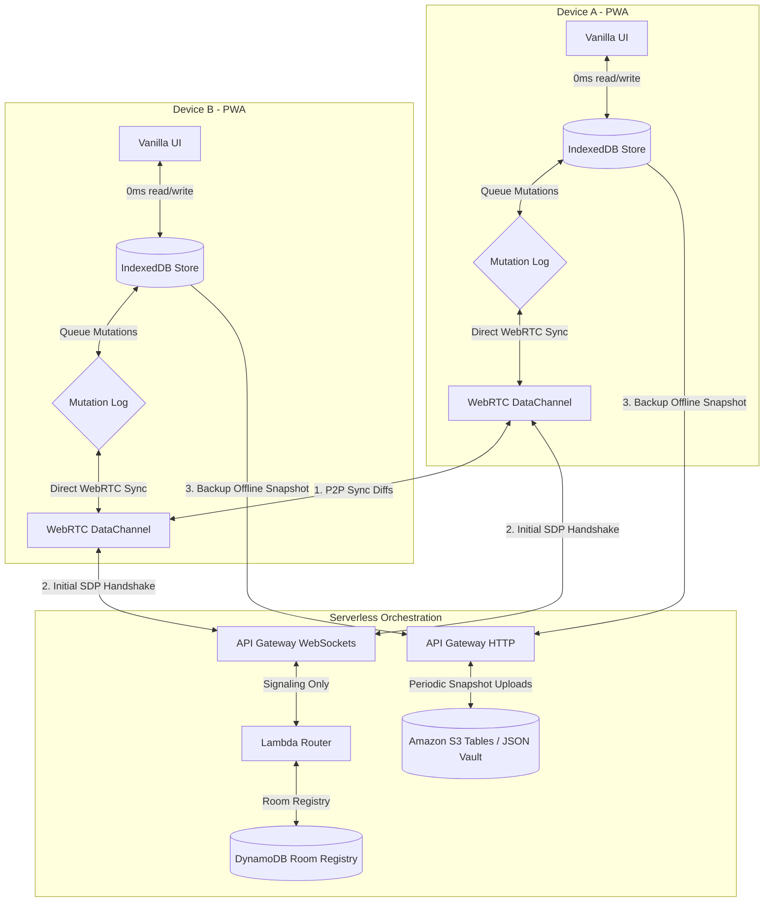

# Architecture Blueprint: Vanilla P2P Local-First Sync

This blueprint outlines a **100% library-free, vanilla client-side architecture** for implementing peer-to-peer (P2P) database synchronization inside a Progressive Web Application (PWA). It leverages native browser APIs (IndexedDB, WebRTC, and Background Sync) paired with serverless cloud services (AWS API Gateway WebSockets, Lambda, and DynamoDB/S3 Tables) to create a highly resilient, low-latency, and virtually free data synchronization engine.

---

## 1. High-Level Architectural Flow



### Protocol Execution Stages
1. **Local-First Writes**: Read/write operations commit instantly to **IndexedDB**. A transaction log records mutations alongside a **Hybrid Logical Clock (HLC)** timestamp and **Tombstones** (soft deletes).
2. **Signaling Connection**: The PWA connects to **AWS API Gateway WebSockets** only to find peers sharing the same credentials or room ID.
3. **Direct P2P Sync**: Once the WebRTC DataChannel connects, the WebSocket connection is **disconnected** to minimize serverless usage costs. Devices sync change-sets directly over WebRTC.
4. **Cloud Vault Fallback**: If no peers are online, the client pushes its mutation log directly to **Amazon S3 Tables** or **DynamoDB** using AWS API Gateway HTTP APIs or secure pre-signed URLs (bypassing Lambdas entirely to save cost).

---

## 2. Client-Side Conflict Engine (Vanilla TypeScript)

No libraries are used in the client. The core synchronization engine is composed of a lightweight **Hybrid Logical Clock (HLC)** and **Last-Write-Wins (LWW)** conflict resolution logic with **Tombstones** (soft deletes).

### Hybrid Logical Clock (HLC) Implementation

```typescript
export interface HLCTimestamp {
  ts: number;
  count: number;
  node: string;
}

export class HLC {
  private ts: number = 0;
  private count: number = 0;
  private node: string;

  constructor(nodeId: string) {
    this.node = nodeId;
  }

  /**
   * Generates a new HLC string: `${ts}-${count}-${nodeId}`
   */
  increment(): string {
    const now = Date.now();
    if (now > this.ts) {
      this.ts = now;
      this.count = 0;
    } else {
      this.count++;
    }
    return `${this.ts}-${this.count}-${this.node}`;
  }

  /**
   * Updates the clock based on an incoming timestamp
   */
  receive(incomingStr: string): string {
    const [incomingTsStr, incomingCountStr, incomingNode] = incomingStr.split('-');
    const incomingTs = parseInt(incomingTsStr, 10);
    const incomingCount = parseInt(incomingCountStr, 10);
    const now = Date.now();

    this.ts = Math.max(now, this.ts, incomingTs);

    if (this.ts === incomingTs && this.ts === now) {
      this.count = Math.max(this.count, incomingCount) + 1;
    } else if (this.ts === incomingTs) {
      this.count = incomingCount + 1;
    } else if (this.ts === now) {
      this.count = this.count + 1;
    } else {
      this.count = 0;
    }

    return `${this.ts}-${this.count}-${this.node}`;
  }

  /**
   * Compares two HLC timestamps (LWW)
   */
  static compare(a: string, b: string): number {
    const [aTs, aCount, aNode] = a.split('-');
    const [bTs, bCount, bNode] = b.split('-');

    const diffTs = parseInt(aTs, 10) - parseInt(bTs, 10);
    if (diffTs !== 0) return diffTs;

    const diffCount = parseInt(aCount, 10) - parseInt(bCount, 10);
    if (diffCount !== 0) return diffCount;

    return aNode.localeCompare(bNode);
  }
}
```

### The Mutation Schema & Tombstones
Every record written to our database has an associated HLC metadata block:

```typescript
export interface TodoRecord {
  id: string;          // Stable UUID
  text: string;
  complete: boolean;
  is_deleted: boolean; // Tombstone flag (soft delete)
  hlc: string;         // Hybrid Logical Clock of last mutation
}
```

---

## 3. Client-Side Storage: IndexedDB Wrapper

Instead of wrapping a database library, we use a simple, robust, strongly typed native **IndexedDB** transaction wrapper:

```typescript
export class LocalStore {
  private dbName = 'todo-pwa-db';
  private version = 1;
  private db: IDBDatabase | null = null;

  async init(): Promise<void> {
    return new Promise((resolve, reject) => {
      const request = indexedDB.open(this.dbName, this.version);
      
      request.onerror = () => reject(request.error);
      request.onsuccess = () => {
        this.db = request.result;
        resolve();
      };
      
      request.onupgradeneeded = (e) => {
        const db = request.result;
        if (!db.objectStoreNames.contains('todos')) {
          // Stable indexing by todo ID
          const store = db.createObjectStore('todos', { keyPath: 'id' });
          store.createIndex('hlc', 'hlc', { unique: false });
        }
      };
    });
  }

  async getTodo(id: string): Promise<TodoRecord | null> {
    return this.runTx('todos', 'readonly', (store) => store.get(id));
  }

  async putTodo(record: TodoRecord): Promise<void> {
    return this.runTx('todos', 'readwrite', (store) => store.put(record));
  }

  async getAllTodos(): Promise<TodoRecord[]> {
    return this.runTx('todos', 'readonly', (store) => store.getAll());
  }

  private async runTx<T>(
    storeName: string, 
    mode: IDBTransactionMode, 
    operation: (store: IDBObjectStore) => IDBRequest
  ): Promise<T> {
    if (!this.db) throw new Error('Database not initialized');
    return new Promise((resolve, reject) => {
      const tx = this.db!.transaction(storeName, mode);
      const store = tx.objectStore(storeName);
      const request = operation(store);
      
      request.onsuccess = () => resolve(request.result);
      request.onerror = () => reject(request.error);
    });
  }
}
```

---

## 4. WebRTC Direct Sync Protocol (Vanilla)

The direct synchronization protocol executed between Client A and Client B via the WebRTC `RTCDataChannel`:

```typescript
export class PeerSyncEngine {
  private channel: RTCDataChannel;
  private store: LocalStore;
  private hlc: HLC;

  constructor(channel: RTCDataChannel, store: LocalStore, hlc: HLC) {
    this.channel = channel;
    this.store = store;
    this.hlc = hlc;
    this.setupListeners();
  }

  private setupListeners(): void {
    this.channel.onmessage = async (e) => {
      const message = JSON.parse(e.data);
      
      if (message.type === 'sync-init') {
        // Step 1: Peer requests mutations newer than their latest HLC timestamp
        const clientLatestHlc = message.latestHlc;
        const allTodos = await this.store.getAllTodos();
        
        // Filter changes that are newer than client's HLC
        const changes = allTodos.filter(todo => 
          !clientLatestHlc || HLC.compare(todo.hlc, clientLatestHlc) > 0
        );
        
        this.channel.send(JSON.stringify({
          type: 'sync-diff',
          changes
        }));
      } 
      
      else if (message.type === 'sync-diff') {
        // Step 2: Receive mutation diffs from peer
        const incomingChanges = message.changes as TodoRecord[];
        
        for (const incoming of incomingChanges) {
          const local = await this.store.getTodo(incoming.id);
          
          // Apply change if it has a higher clock (Conflict Resolution)
          if (!local || HLC.compare(incoming.hlc, local.hlc) > 0) {
            // Update local HLC based on incoming clock
            this.hlc.receive(incoming.hlc);
            await this.store.putTodo(incoming);
            console.log(`[P2P Sync] Applied record mutation: ${incoming.id}`);
          }
        }
        
        // Dispatch custom global event to refresh the UI
        window.dispatchEvent(new CustomEvent('db-sync-complete'));
      }
    };
  }

  /**
   * Triggers the P2P synchronization handshake
   */
  async startSync(): Promise<void> {
    const allTodos = await this.store.getAllTodos();
    
    // Find our latest local clock timestamp to send
    let localMaxHlc = '';
    allTodos.forEach(todo => {
      if (!localMaxHlc || HLC.compare(todo.hlc, localMaxHlc) > 0) {
        localMaxHlc = todo.hlc;
      }
    });

    this.channel.send(JSON.stringify({
      type: 'sync-init',
      latestHlc: localMaxHlc
    }));
  }
}
```

---

## 5. Serverless AWS Orchestration (Zero Maintenance, Near-Zero Cost)

By using pay-per-request serverless tiers, running this cloud architecture for a standard application will fall completely inside the **AWS Free Tier** (or cost pennies per month).

```
                      +---------------------------------------+
                      |       AWS API Gateway WebSockets      |
                      |   - Peer discovery & Signaling        |
                      |   - Event-driven WebSocket routing    |
                      +---------------------------------------+
                                          |
                                          v
                      +---------------------------------------+
                      |           AWS Lambda (Router)         |
                      |   - Room matching / peer connection   |
                      |   - Session metadata management       |
                      +---------------------------------------+
                                          |
                                          v
                      +---------------------------------------+
                      |         Amazon DynamoDB Tables        |
                      |   - Keeps track of: roomId -> peerIds |
                      |   - TTL handles auto-cleanup          |
                      +---------------------------------------+
```

### A. The Signaling Phase (API Gateway + DynamoDB)
* **API Gateway WebSockets**: Standardizes WebSockets without active server infrastructure. It maps `$connect`, `$disconnect`, and custom events (e.g. `signal`) directly to AWS Lambdas.
* **AWS Lambda**: Coordinates room discovery. A device sends a `join-room` message, and Lambda stores their `connectionId` in DynamoDB under a matching hash (e.g. `UserId`).
* **DynamoDB Room Registry**: Maintains room state. Uses a **Time-To-Live (TTL)** property on rows to automatically prune abandoned sessions, ensuring data never piles up and keeping storage costs at `$0`.

### B. Persistent Backups: Serverless Cloud Vault (Pre-Signed S3 Tables)
If no other peer devices are online, the client backs up its data to the cloud. We completely eliminate Lambda execution costs by letting the client upload its mutation logs directly to **Amazon S3** using secure, temporary pre-signed upload URLs:

```
+------------+   1. GET /get-upload-url   +-------------+
|  Client A  | =========================> | API Gateway |
+------------+                            +-------------+
      |                                          |
      | 3. PUT backup.json                       | 2. Lambda returns
      |    (Direct Upload)                       |    Pre-signed URL
      v                                          v
+------------+                            +-------------+
| Amazon S3  |                            | AWS Lambda  |
+------------+                            +-------------+
```

1. **Pre-signed URL Fetch**: The client makes a quick `GET` request to a secure API Gateway HTTP endpoint. A Lambda generates an AWS S3 pre-signed upload URL for `s3://app-backups/user-id/data.json` and immediately terminates.
2. **Direct S3 Streaming**: The client uploads the zipped JSON database log directly to S3 via standard `PUT` with the pre-signed URL. 
   - **Cost Efficiency**: S3 handles the network transport and file storage directly. No active servers run, and Lambda runtime is capped at milliseconds.
   - **Modern S3 Tables**: Leveraging the new **Amazon S3 Tables** formats provides cheap queryable tabular datalakes ($0.023/GB), making cloud synchronization extremely scalable and cost-effective.

---

## 6. Advanced AWS Infrastructure: CloudFront + VTL Direct Service Integrations

To take this architecture to the absolute limits of privacy, security, and cost efficiency, we can eliminate Compute cost (Lambdas) and hide infrastructure under a single unified domain.

### A. CloudFront Single-Domain Edge Proxy
Placing **Amazon CloudFront** in front of S3 and API Gateway provides several key advantages:
1. **Single-Domain Privacy**: Serve your PWA frontend, REST APIs, and WebSocket routes under the *exact same domain* (e.g., `app.example.com`).
   * `/` routes to the S3 bucket hosting static PWA assets (`index.html`, etc.).
   * `/ws` routes to the API Gateway WebSocket API.
   * `/api` routes to S3 proxy endpoints or S3 Tables.
2. **Zero CORS Issues**: Because everything is served under the same origin, the browser enforces no CORS validation, bypassing complex preflight pre-checking.
3. **Infrastructure Concealment**: Users only see your custom domain. The names of S3 buckets and AWS regional API Gateway endpoints are entirely hidden from client inspect tools.

### B. Bypassing Lambda entirely using VTL Direct Service Integrations
Instead of executing Lambdas for signaling, we can configure **AWS API Gateway WebSockets** to interact directly with DynamoDB using **Velocity Template Language (VTL)** mapping templates. 

* **The Connection Handler ($connect)**:
  When a PWA connects, API Gateway runs a VTL template to write `connectionId` and `roomId` directly into DynamoDB via a `PutItem` service integration. **0ms cold start, $0 Lambda cost.**
  ```xml
  ## VTL Mapping Template for API Gateway WebSocket $connect
  {
    "TableName": "WebSocketConnections",
    "Item": {
      "ConnectionId": {"S": "$context.connectionId"},
      "RoomId": {"S": "$input.path('$.roomId')"},
      "TTL": {"N": "$math.add($context.requestTimeEpoch, 86400)"} ## Auto-prune in 24h
    }
  }
  ```
* **Direct S3 Proxying (No Pre-Signed URLs)**:
  Instead of having a Lambda generate pre-signed upload URLs, configure API Gateway HTTP API to act as a **Direct S3 Proxy**. The client POSTs its incremented mutations to `app.example.com/api/backup/user-123`. API Gateway uses VTL to map this request and streams it directly into S3 using a secure IAM role. **0 Lambdas executed, 0 compute execution charges!**

---

## 7. Passive Reconciliation: Reaching "Truth" When Devices Are Offline

What happens when multiple offline devices make changes and then reconnect at completely different times, never interacting directly via WebRTC?

### The Passive Event-Streaming Synchronization Flow

1. **The Cloud Vault is an Append-Only Log**:
   In the cloud (S3 or DynamoDB), your data is stored as a timeline of incremental mutations (changesets) keyed by HLC and UserId.
2. **The Sync Cycle**:
   * **Device A goes online**:
     1. Device A queries S3 or DynamoDB for any mutations uploaded by other devices that possess an HLC timestamp *higher* than Device A's last recorded sync clock.
     2. It downloads the incremental changes and applies them to its local IndexedDB. Our **LWW (Last-Write-Wins) Clock Engine** deterministically merges the edits: if the incoming mutation's HLC is newer, it overwrites the local field; otherwise, the local edit remains.
     3. Device A now uploads its own offline mutation list (only changes made since its last sync).
   * **Device B goes online later**:
     1. Device B performs the exact same query. It immediately downloads all the new changesets Device A uploaded.
     2. Device B applies them locally. The exact same LWW rules run on Device B. Because HLC ordering is mathematically stable, Device B converges to the **exact same logical state** as Device A.
     3. Device B uploads its new changes.
3. **Ultimate Consistency**:
   Because conflict resolution runs in the clients using mathematical clocks, the cloud storage does not need to be "smart" or run database conflict checks. It only acts as a passive, high-speed, cheap mirror of changesets.

---

## 8. Incremental Sync vs. Payload Bloat

To prevent uploading the entire database (payload bloat) on every sync cycle, the architecture strictly handles incremental streaming.

### A. The Append-Only Log Pattern
Instead of writing the whole database snapshot as a single JSON file, every transaction in IndexedDB is written to an **Append-Only Outbox Table**:

```typescript
export interface MutationLog {
  id: string;          // UUID of the transaction
  table: string;       // e.g. 'todos'
  recordId: string;    // ID of the record being changed
  action: 'put' | 'delete';
  payload: Partial<TodoRecord>;
  hlc: string;         // Hybrid Logical Clock when mutation occurred
  synced: number;      // 0 = pending, 1 = synced
}
```

* **When Syncing**: The PWA only selects mutations from the outbox where `synced = 0`.
* **Dynamic Append**: In DynamoDB, the client writes these rows directly as new items. In S3, the client appends them as tiny files or appends them to a session delta file (`deltas/user-123/ts-node.json`). This ensures that sync payloads are tiny—typically under **2KB**—rather than megabytes of redundant database states.

---

## 9. Data Residency, Browser Eviction, & Lazy-Hydration at Scale (1GB+ Data)

PWAs operate inside sandboxed browser contexts. We must design defenses against data eviction and network limits when scaling to massive database sizes.

### A. Defending Against Browser Storage Eviction
Browsers partition disk space dynamically. If the device runs low on disk storage, the browser's storage manager can **silently evict IndexedDB** to reclaim space!
To prevent this, our application must request **Persistent Storage Permission**:

```typescript
export async function secureLocalStorage(): Promise<boolean> {
  if (navigator.storage && navigator.storage.persist) {
    // Request permission from browser
    const isPersisted = await navigator.storage.persist();
    console.log(`[Storage] Storage persistence granted: ${isPersisted}`);
    return isPersisted;
  }
  return false;
}
```
> [!IMPORTANT]
> Once the browser grants `persist()` permission, the database is marked as **exempt** from automatic eviction. The browser will never delete your PWA's IndexedDB data unless the user explicitly uninstalls the app or clears browser data manually.

### B. Scalability Blueprint: Metadata vs. Heavy Payloads (Lazy Hydration)
Exchanging a 1GB database directly over a WebRTC DataChannel or loading it completely into the browser memory will crash the client tab and deplete network plans. 
We solve this by separating **Metadata** from **Heavy Payloads**:

```
+-------------------------------------------------------------+
|                     IndexedDB Local Store                   |
| - Fast Metadata: Titles, Dates, Status, IDs (Under 20MB)    |
| - Globally synced via P2P (WebRTC) / Incremental Log       |
+-------------------------------------------------------------+
                               |
                               | (References S3 Attachment Key)
                               v
+-------------------------------------------------------------+
|                     Amazon S3 Heavy Storage                 |
| - Large Payloads: Attachments, Images, Full Text (1GB+)     |
| - Fetched ON-DEMAND (Lazy Hydration) & Cached Locally       |
+-------------------------------------------------------------+
```

1. **Replicate Metadata Only**:
   All core synchronization (both WebRTC P2P and S3 incremental logs) is restricted to **Metadata** (e.g., Todo titles, completeness status, tags, and attachment references). Even with 100,000 tasks, this metadata represents less than **20MB** of text data—easily synced over P2P WebRTC instantly!
2. **On-Demand Lazy Hydration**:
   Heavy data (such as todo image attachments, PDF documents, or large notes) is never replicated P2P. Instead, the metadata contains a secure S3 pointer (e.g. `attachmentKey: "attachments/todo-456.pdf"`).
3. **Targeted Fetching**:
   When the user clicks to view an attachment, the client PWA makes a direct, lazy-hydrated request to CloudFront to retrieve the attachment. Once fetched, the attachment is placed in the browser's **Cache Storage API** (handled by the PWA's Service Worker).
4. **Resilient Eviction**:
   If the browser reclaims disk space, the heavy attachments stored in Cache Storage can be safely cleared. The master copy remains securely hosted in S3, ready to be lazy-hydrated again when requested!
